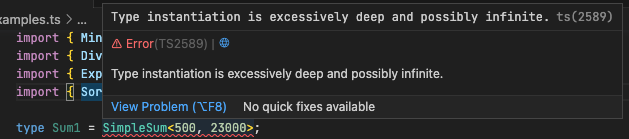
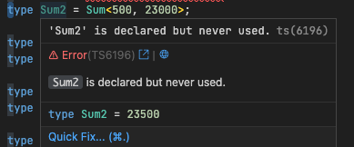
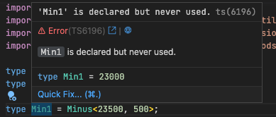
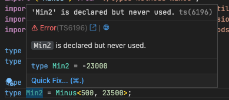
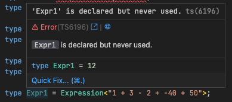
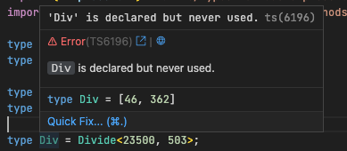
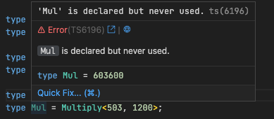
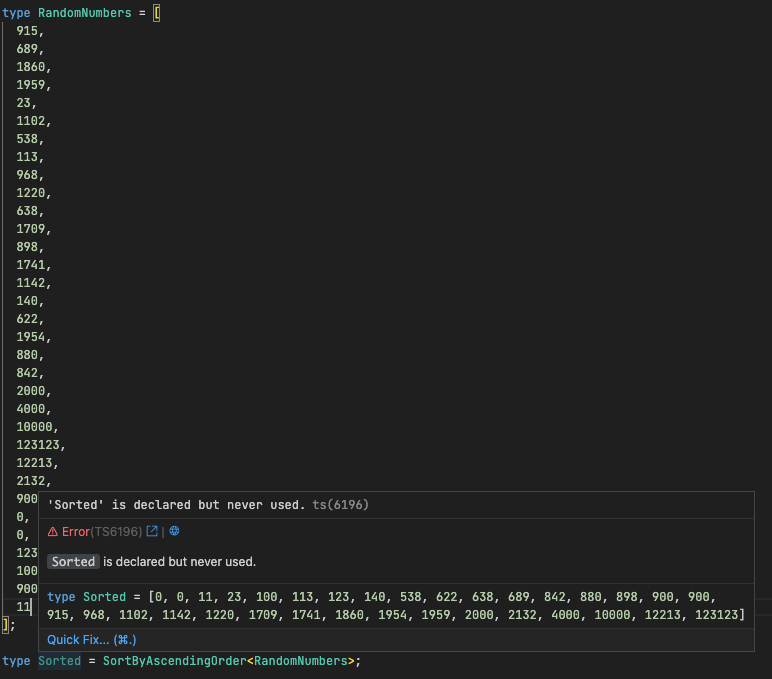

# Playground of "advanced" TypeScript types

Created originally for AoC 2022, might post solutions later (managed to do ~10 first days with types).

The repository contains a bunch of types that might or might not work, but feel free to check the other files as well that are not described below.

## [Summation](./types-methods-sum.ts)

Sum two numbers together:

There are two ways of summing numbers together:

### `SimpleSum`

SimpleSum type works by appending elements to array and accessing `['length']` property of the said array.

Limited to 1000 due to recursion limits.

### `Sum`

Sum type works by transforming and translating strings.

## [Subtraction](./types-methods-minus.ts)

Subtract one number from another:

Works also for negative values:

## [Expression](./types-methods-expression.ts)

Summation and subtraction can also be chained in a natural expression with `Expression` type:

## [Division](./types-number-utils.ts)

Divide two numbers:

Returns whole division and remainder.

## [Multiplication](./types-number-utils.ts)

Multiplies two numbers together.

## [Sort](./types-methods-sort.ts)

List of numbers can be sorted with `SortByAscendingOrder` type. Tried to implement quicksort and it works quite well.

Does not work with negative numbers (those are appended to the end of list atm).

